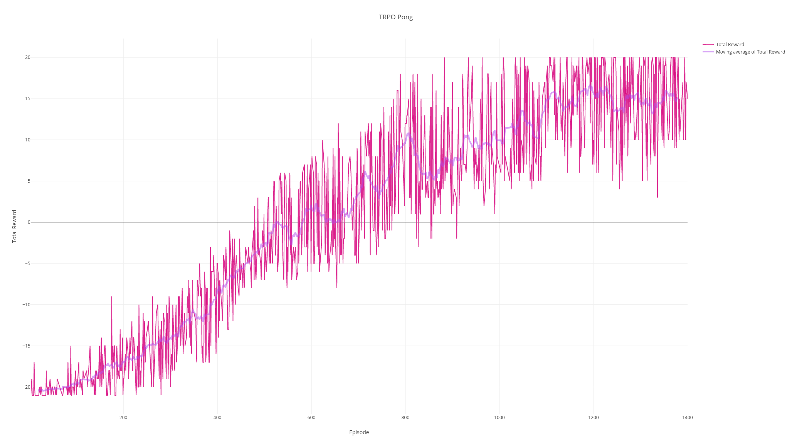

# PyTorch implementation of TRPO
This repo contains a PyTorch implementation of a [Trust Region Policy Optimization](http://arxiv.org/abs/1502.05477) agent for an environment with a discrete action space.

# Environment Setup
1. Install [conda](https://www.anaconda.com/download) for Python 2.7.

2.
```
conda create --name trpo --file requirements/conda_requirements.txt
source activate trpo
pip install -r requirements/pip_requirements.txt
```

3. Install [PyTorch](http://github.com/pytorch/pytorch) from source at commit eff5b8b or later.

# Usage
```
python run_trpo.py --env=GYM_ENV_ID
```
where GYM_ENV_ID is the environment ID of the [gym](http://github.com/openai/gym) environment you which to train on.

# Results


A game of Pong as played using the policy model learned from a TRPO agent



Plot of total reward per episode of Pong vs. episode number

# Related Repos
[OpenAI's Baseline implementation of parallel TRPO in TensorFlow](https://github.com/openai/baselines/tree/master/baselines/trpo_mpi)

[Ilya Kostrikov's implementation of TRPO for continuous control in PyTorch](https://github.com/ikostrikov/pytorch-trpo)
